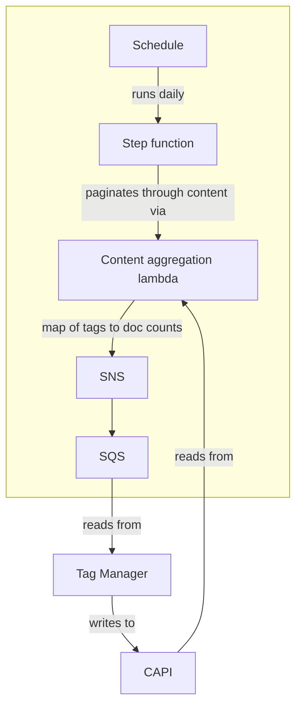

# Content aggregation

A service to poll CAPI for entity usages against content, and push them to their owning services, so they can be generally available in the owning service, and in CAPI.

## The problem

Both our content and the tags and atoms that are referenced by it are stored in our Content API, which uses Elasticsearch for persistence, retrieval, and search. Each entity is stored in a separate index in Elasticsearch.

This presents a problem when we want to understand how these entities relate to eachother, because it's not possible to join indices in queries in Elasticsearch as you might in a relational database. Queries like:

- find our most or least used tags/atoms as they relate to content
- find the top 10 most relevant tag for the query string `sport`, weighting order by content usage count (important for relevance — there are many tags containing the keyword `sport`)

... are not possible without storing additional information.

There are a few possible solutions to this problem:
1. Denormalise the related entity into the content index. This isn't desirable in the case of tags or atoms, because the write amplification for widely-used entities is likely to cause performance problems — for example, updating the `type/article` tag would touch `2507577` pieces of content at time of writing.
2. Iterate through all the available entities on a schedule, and:
   1. write the information back in CAPI. This won't work well: Porter, the CAPI service that's responsible for writing to Elasticsearch, does not perform partial updates for performance reasons, these counts will be continually overwritten and refreshed when documents are updated from elsewhere.
   2. Iterate through all the available entities on a schedule, and write the information back to the service that owns that entity.

This repo implements 2. ii).

## How it works

Here's an example of how it works to backfill the number of documents that refer to a given tag in Tag Manager:

We use an event queue to avoid applying write pressure to the owning service, which can then pull records at its convenience.
